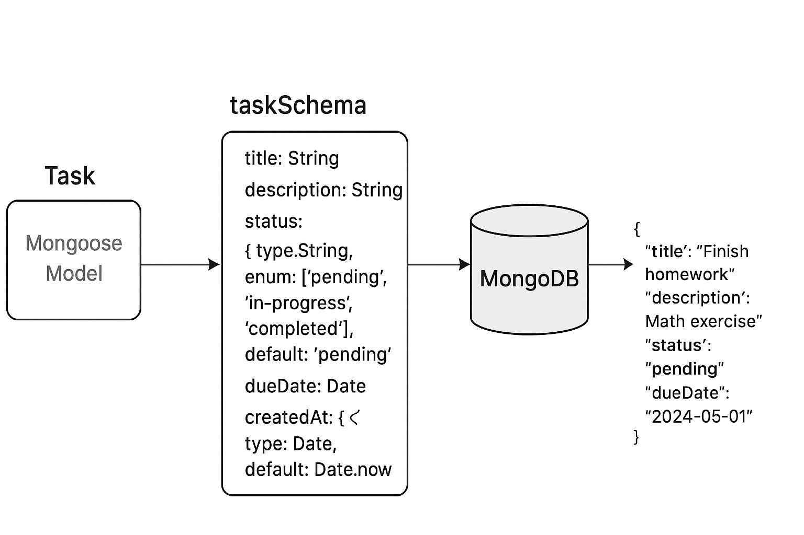

# Create new API

when creating a new api, fully independent from the other apis in the project, creating new projects, we are then creating and setting up a new installation and folder for this new project. In order to do this, we will need to a start setup and create the nessusary base folder and files for it to run successfully. There are more than one way to do this, but as the first and second project uses mongodb for the server, that is the first recomendations to use. However, of course it can be extended and done with other setups.

## API setup with mongodb local server.

In order for this setup to work one needs to have Install MongoDB locally (via MongoDB Community Server), which is a standard with node.js, as well as flexible schemas, with a lot of tutorials and example code out there to learn from or solve issue with. For the a simple setup the following steps should setup the base for the code.

1. Create a new folder within smallProjects (try to keep each project smaller rather than big, and focus on specific problems or tasks.)
2. navigate into the folder and run "npm init -y" to setup the package.json file
3. run "npm install express mongoose bcryptjs jsonwebtoken dotenv" to setup a large amount of dependesies, and what will be needed for Express, mongoose, JWT, and a few helpers.
4. Run "npm install --save-dev nodemon" for development convinences.
5. npm install cors 
6. create a file called "server.js"
7. Create a folder called routes, and create a starting "js" file, where each starting route will be stored.(name yourself)
8. Create "openapi.yaml" file and a ".env" file
    - the ".env" will contain the information needed in regards to port, address, and if it should have JWT for authentication.
9. Fill in the ".env"
    - a simple example could be the following(note you may need to adjust adress and port)
        PORT=5001
        MONGO_URI=mongodb://127.0.0.1:27017/task_tracker
        JWT_SECRET=supersecret-task // This is need for generating json web tokens for authentication
    - run "node -e "console.log(require('crypto').randomBytes(64).toString('hex'))" to get a JWT secret key, never spread this!!
10. follow the 'openapis.md' documentation to figure out how to connect the new api to the swagger ui.

### Models

This contains the information in regards to how the mongodb database is setup and structured. This will be the base of the database. When creating a single table datbase you can follow the following steps. 
1. import mongoose from 'mongoose'
2. Create a schema which can look like 'const taskSchema = new mongoose.Schema({});'
    - this schema defines the creation of a table, and then specifications need to be set for the paramaters
        - name: type
            - the type can be int, float, string, date, and more
        - name2: {type: int, required: true} 
            - you can set it to be required by seting true, not needed if you will just have as false.
        - name3: {type: string, enum:['pending', 'in-progress', 'completed'], default: 'pending' } 
            - you can set an enum for the row, meaning you specifiy what values it can be set to
            - That enum can have a defualt value if nothing else isn't set on it.
3. set up an export for the model, example 'export default mongoose.model("Task", taskSchema);'
    - will be required for the routes to access it.
