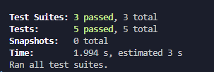
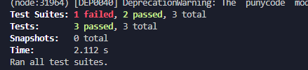

# Testing

The project is designed to be tested in multiple ways to increase stability and security by reducing faults in the system. Testing is executed on multiple levels. There are Postman scripts that are run locally to verify system setups, which are then configured to run via CI/CD GitHub Actions for each pull request, as well as on pushes to the main branch. Additionally, more code-based testing occurs within the code itself, set up to run **integration**, **DAO**, and **unit tests** as required.

## CI/CD GitHub Actions

The CI/CD setup uses Postman scripts that are created in Postman, exported, and added to the respective project’s own folder within a `postman` directory. This makes it easier to identify where each project's tests are located. To run the CI setup, it is important that the GitHub Action workflow is configured correctly, so it knows where to look and how to execute. To achieve this, a `.github` folder is created with a `workflows` subfolder. You can read more about this setup in `CI_CD_learn.md`.  

This setup ensures that the API tests are run automatically for each pull request. The actions do not run locally; they only run through GitHub Actions. However, if desired, the Postman scripts can still be run directly in Postman.

## Integration and Unit Testing

Compared to the CI/CD actions that run via Postman or GitHub Actions, these tests can be run locally within the system, even when the port and API are not accepting requests. These tests verify the **integrity and functionality** of the code, ensuring it behaves as expected.  

To run these tests locally, follow these steps:

1. Open a terminal and navigate to the project you want to test.  
2. In the terminal, enter:
    `npm test`
    - This should show the tests running and then display the results.  
        - Example of a successful test:   
        - Example of a failed test: 
